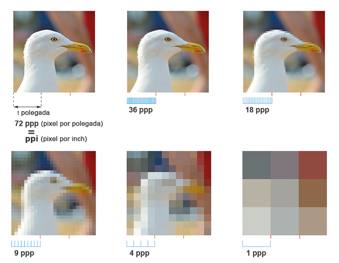
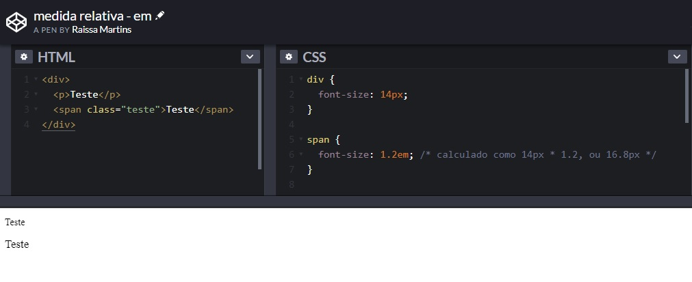

# Conteúdo - Aula 19/10

Responsividade:

1 [Layout Responsivo](#layoutResponsivo)

2 [Resolução de tela x Tamanho de tela](#resolucaoTamanho)

3 [Unidades de medida responsivas](#unidadesMedida)

4 [Breakpoints & Media Queries](#breakpointsMedia)

5 [Tipos de displays](#displays)

6 [Mobile First](#mobileFirst)

--- 

# Responsividade

## Layout Responsivo 

Um layout responsivo é aquele que se adapta automaticamente aos diversos tamanhos de telas dos dispositivos no qual ele está sendo visualizado e é parte fundamento do conceito de **design responsivo**, que nada mais é do que a possibilidade de adaptação fluida de um site a diversos tamanhos de tela.

**Tipos de dispositivos:**
* Notebooks
* Tablets
* Celulares
* Desktops  
* Televisões

**Alguns fundamentos para a construção de um layout responsivo são:**
* Redimensionar imagens automaticamente
* Simplificar e/ou ocultar elementos
* Adaptar o tamanho de botões e links para interfaces touch

**Vantagens:**
* Usabilidade (design adaptado para diversos formatos)
* Manuntenção (não precisa desenvolver outras versões)
* SEO Google (tudo em uma url só)

**Desvantagens:**
* Desenvolvimento apenas para os principais dispositivos do mercado
* Versões antigas de navegadores que não reconhecem a linguagem de adapatação
* Necessidade de uma pré construção da arquitetura do código e do layout
* Um pouco mais demorado para carregar 

---

## Resolução de tela x Tamanho de tela

**Resolução:** é a medida de definição de imagens digitais, que utiliza o **pixel** como unidade de medida.

**Tamanho de tela:** tamanho físico da tela, normalmente medido em polegadas.

* Pixels por polegada: PPI - __**P**ixels **P**er **I**nch__ para monitores e telas

É fundamental termos em mente que a resolução é determinada pelo tamanho da tela (expresso pela sua altura e largura) mais a quantidade de pixels nela inserida.

Dessa forma, olhando simplesmente para o tamanho (largura x altura) não podemos afirmar que esse possui alta ou baixa resolução. A quantidade de pixels contidas nele, é que dirá se o mesmo possui alta ou baixa resolução.

Podemos ter um tamanho de tela com dimensões grandes porém com poucos pixels. O inverso também é possível, um tamanho com dimensões pequenas porém com muitos pixels. Assim, dispositivos que possuem o mesmo tamanho nem sempre possuem uma mesma resolução. 

---

## Unidades de medida responsivas

### Medidas absolutas:

Essas são as mais comuns que vemos no dia a dia. São medidas que não estão referenciadas a qualquer outra unidade, ou seja, não dependem de um valor de referência.

Essas medidas são fixas e não mudam de acordo com as especificações do dispositivo.

__Quais são:__ pixels (px), points (pt), inches/polegadas (in), centímetro (cm), milímetro (mm) e paica (pc)

* 96px = 1 in = 2,54cm = 25,4mm = 72pt = 6pc

### Medidas relativas:

Essas são as que normalmente não estamos habituados. Essas medidas são calculadas tendo como base uma outra unidade de medida pré definida.

Devido ao fato de que essas medidas serem calculadas pelo browser baseando-se em outra unidade, elas tendem a ser bastantes flexíveis. Ou seja, podemos ter resultados diferentes de acordo com o tamanho de tela. 

__Quais são:__

* em

    **EM** é uma unidade de medida tipográfica. Para entender sua aplicação, vamos utilizar o exemplo abaixo onde foi definido um tamanho de fonte no elemento `
`, o valor de **em** declarado em qualquer elemento-filho dentro de `
` será igual a: **o valor declarado no elemento-filho * o valor declarado no elemento pai**. 

    Nesse caso: **1.2(em) * 14px = 16.8px**

    

    Entretanto, o que acontece quando se tem um elemento com valor **em** dentro de outro elemento com valor **em**?

    

* rem

    O **REM** vem como sucessor do **EM** e ambos compartilham a mesma lógica de funcionamento, porém a forma de implementação é diferente. Enquanto o em está diretamente relacionado ao tamanho da fonte do elemento pai, o **rem** está relacionado com o tamanho da fonte do **elemento root (raiz)**.

    

* porcentagem %

    Apesar de não ser uma unidade de medida, a porcentagem costuma ser bastante utilizada quando falamos de layout responsivo e fluido por conta de seu caráter adaptativo.

      

    A porcentagem permite que criemos elementos que sempre vão se readaptar para ocupar a quantidade especificada.

    

    **Note que a propriedade `width:` é relativa ao elemento-ancestral mais próximo.** 

* vh e vw

    Muitas técnicas de web design responsivo dependem muito de regras percentuais. Mas e se fosse preciso usar a largura ou a altura da viewport ao invés da largura do elemento-pai?Isso é exatamente o que as unidades vh e vw proporcionam.

    A medida vh é igual a 1/100 da altura da viewport. Então, por exemplo, se a altura do navegador é 900px, 1vh equivale a 9px e, analogamente, se a largura da viewport é 750px, 1vw equivale a 7.5px.

    Vamos conferir o [exemplo](./exemplos/exemplo-medidas-viewport)

* Outras unidades de medida

    **vmax e vmin:** [UNIDADES CSS RELATIVAS: VW, VH, VMAX, VMIN (CSS3)](https://www.youtube.com/watch?v=g__c-7M9Xzk&t=94s)

    **ex e ch:** [UNIDADES CSS RELATIVAS: %, REM, EM, CH, EX (CSS3)](https://www.youtube.com/watch?v=etM0JBeFbf8)

---

## Breakpoints e Media Queries

---

## Tipos de displays
### Flex
### Grid

---

## Mobile First

